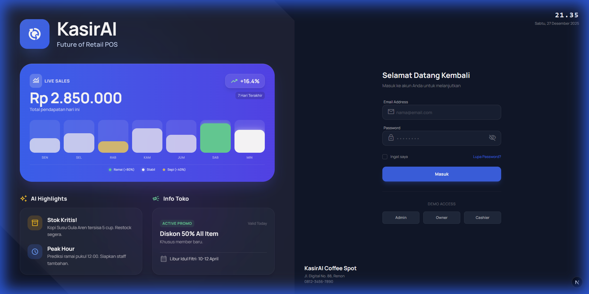
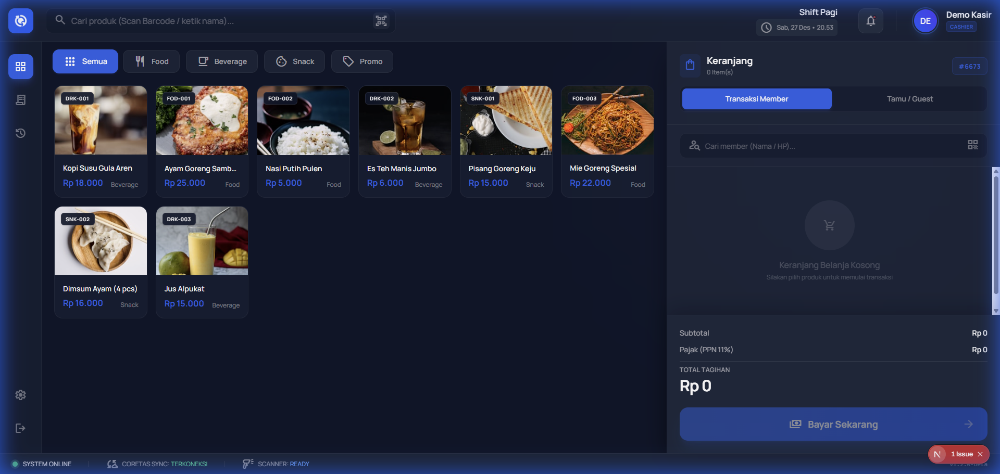
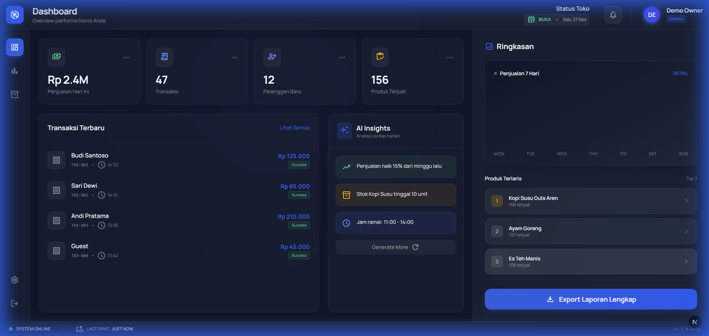

<p align="center">
  
</p>

<h1 align="center">KasirAI</h1>

<p align="center">
  <strong>Fintech-Grade AI-Powered POS untuk UMKM Indonesia</strong>
</p>

<p align="center">
  <a href="#fitur">Fitur</a> •
  <a href="#arsitektur">Arsitektur</a> •
  <a href="#instalasi">Instalasi</a> •
  <a href="#deployment">Deployment</a>
</p>

<p align="center">
  
  
  
  
</p>

***

## Overview

**KasirAI** adalah sistem POS multi-tenant untuk UMKM Indonesia dengan standar fintech-grade. Menggabungkan operasi kasir cepat dengan AI business intelligence.

> 💡 *Bukan sekadar kasir — asisten bisnis AI untuk pemilik usaha.*

***

## 📸 Tampilan Antarmuka

<div align="center">
  <table>
    <tr>
      <td align="center">
        <b>Halaman Login</b><br>
        
      </td>
      <td align="center">
        <b>POS (Kasir)</b><br>
        
      </td>
      <td align="center">
        <b>Dashboard (Owner)</b><br>
        
      </td>
    </tr>
  </table>
</div>

***

## Fitur

### 🧾 POS Core

* **Cashier-first UX** — Minimal klik, keyboard shortcuts, checkout cepat
* Kalkulasi real-time dengan breakdown transparan
* Mode transaksi member & non-member
* Struk digital

### 💳 Pembayaran (Midtrans)

| Metode | Deskripsi |
|--------|-----------|
| **QRIS** | QR dinamis, scan & bayar instan |
| **GoPay** | E-wallet Gojek |
| **OVO** | E-wallet OVO |
| **ShopeePay** | E-wallet Shopee |
| **Dana** | E-wallet Dana |
| **Kartu Kredit/Debit** | Visa, Mastercard, JCB |
| **Bank Transfer** | BCA, Mandiri, BNI, BRI, Permata |
| **Cash** | Pembayaran tunai |

> 💰 **Dana langsung masuk ke rekening pemilik usaha** yang didaftarkan saat registrasi tenant di KasirAI.

### 👥 Program Loyalitas

* **Tier member**: Regular, Silver (1.2x), Gold (1.5x), Platinum (2x) poin
* Konfigurasi earning & redemption fleksibel
* Registrasi member cepat
* Proteksi margin

### 🎫 Mesin Diskon

* Diskon persentase & nominal
* Minimum pembelian
* Batas penggunaan & periode validitas
* Enforcement maksimal diskon

### 📊 Pajak & Kepatuhan

* Kalkulasi pajak inklusif/eksklusif
* Pemisahan DPP (Dasar Pengenaan Pajak)
* **Export Coretax Indonesia**
* Audit trail lengkap

### 🤖 AI Insights (Groq)

* Analisis penjualan harian
* Metrik efektivitas diskon
* Tracking ROI loyalitas
* **Bahasa Indonesia & English**

### 📲 Notifikasi Telegram

* Alert transaksi real-time
* Laporan ringkasan harian
* AI business coaching

***

## Arsitektur

```
┌─────────────────────────────────────────────────────────────┐
│                     Frontend (Next.js)                       │
│               POS Interface • Owner Dashboard                │
└─────────────────────────┬───────────────────────────────────┘
                          │ REST API
┌─────────────────────────▼───────────────────────────────────┐
│                    Backend (FastAPI)                         │
│  ┌──────────────┐ ┌──────────────┐ ┌──────────────┐         │
│  │CalculationEngine│ │PaymentService│ │  AI Service  │         │
│  └──────────────┘ └──────────────┘ └──────────────┘         │
└─────────────────────────┬───────────────────────────────────┘
              ┌───────────┼───────────┐
              ▼           ▼           ▼
┌─────────────────┐ ┌─────────────┐ ┌─────────────┐
│    Supabase     │ │   Midtrans  │ │    Groq     │
│   (PostgreSQL)  │ │  (Payment)  │ │    (AI)     │
└─────────────────┘ └─────────────┘ └─────────────┘
```

**Urutan Kalkulasi (Strict):**

```
Subtotal → Diskon → Poin Loyalitas → Pajak → Grand Total
```

***

## Tech Stack

| Layer | Technology |
|-------|------------|
| Frontend | Next.js 16, TypeScript, Tailwind CSS |
| Backend | FastAPI, Python 3.11+ |
| Database | Supabase (PostgreSQL) |
| Payment | **Midtrans** (QRIS, E-Wallet, Card, VA) |
| AI | Groq API |
| Messaging | Telegram Bot API |

***

## Struktur Proyek

```
KasirAI/
├── api/                # FastAPI Backend
│   ├── src/
│   │   ├── api/       # REST endpoints
│   │   ├── core/      # Business logic
│   │   ├── dto/       # Pydantic schemas
│   │   └── ext/       # Midtrans, Groq, Telegram
│   └── main.py
├── web/                # Next.js Frontend
│   └── src/app/
├── db/                 # Database migrations
│   └── migrations/
├── docs/               # Assets & design
├── .env                # Environment config
└── README.md
```

***

## Instalasi

### Prerequisites

* Python 3.11+
* Node.js 18+
* pnpm
* Akun Supabase
* Akun Midtrans (Sandbox/Production)

### Setup

```bash
# Clone
git clone https://github.com/digimetalab/KasirAI.git
cd KasirAI

# Backend
cd api
python -m venv venv
venv\Scripts\activate      # Windows
pip install -r requirements.txt

# Frontend
cd ../web
pnpm install

# Jalankan
cd ../api && uvicorn main:app --reload   # Terminal 1
cd ../web && pnpm dev                     # Terminal 2
```

***

## Konfigurasi

### .env (Root)

```env
# Supabase
SUPABASE_URL=https://xxx.supabase.co
SUPABASE_ANON_KEY=eyJxxx

# Midtrans
MIDTRANS_SERVER_KEY=SB-Mid-server-xxx
MIDTRANS_CLIENT_KEY=SB-Mid-client-xxx
MIDTRANS_IS_PRODUCTION=false

# AI & Notifications
GROQ_API_KEY=gsk_xxx
TELEGRAM_BOT_TOKEN=123456:ABC-xxx

# Next.js Public
NEXT_PUBLIC_SUPABASE_URL=https://xxx.supabase.co
NEXT_PUBLIC_SUPABASE_ANON_KEY=eyJxxx
NEXT_PUBLIC_API_URL=http://localhost:8000
NEXT_PUBLIC_MIDTRANS_CLIENT_KEY=SB-Mid-client-xxx
```

***

## Midtrans Integration

### Alur Pembayaran

```
1. Customer checkout → Frontend kirim ke API
2. API buat transaksi Midtrans → dapat token/QR
3. Frontend tampilkan QR/redirect payment page
4. Customer bayar → Midtrans kirim webhook ke API
5. API update status → kirim notif Telegram
6. Dana masuk langsung ke rekening pemilik usaha
```

### Registrasi Tenant

Saat pemilik usaha daftar di KasirAI:

1. Input data rekening bank (nama, nomor, bank)
2. Data disimpan di Supabase (encrypted)
3. Settlement Midtrans langsung ke rekening tersebut

### Endpoint Payment

| Method | Path | Deskripsi |
|--------|------|-----------|
| POST | `/api/pay/create` | Buat transaksi pembayaran |
| POST | `/api/pay/webhook` | Callback dari Midtrans |
| GET | `/api/pay/status/{id}` | Cek status pembayaran |

***

## API Endpoints

| Method | Path | Deskripsi |
|--------|------|-----------|
| POST | `/api/transactions/cart` | Buat cart baru |
| POST | `/api/transactions/cart/{id}/items` | Tambah item |
| POST | `/api/transactions/cart/{id}/discount` | Apply diskon |
| POST | `/api/transactions/cart/{id}/loyalty` | Redeem poin |
| GET | `/api/transactions/cart/{id}/breakdown` | Hitung total |
| POST | `/api/transactions/cart/{id}/finalize` | Selesaikan transaksi |
| GET | `/api/transactions/export` | Export Coretax |
| GET | `/api/products` | List produk |
| GET | `/api/customers` | List member |
| GET | `/api/discounts` | List diskon |

***

## Deployment

### Backend (Railway/Render)

```bash
docker build -t kasirai-api ./api
docker run -p 8000:8000 kasirai-api
```

### Frontend (Vercel)

```bash
cd web && vercel deploy
```

***

## Roadmap

| Phase | Status |
|-------|--------|
| Backend API + Database | ✅ Selesai |
| Midtrans Integration | 🔄 In Progress |
| Frontend POS UI | ⏳ Planned |
| AI Insights + Telegram | ⏳ Planned |

***

## About

**Digimetalab** — AI Agency, Bali, Indonesia\
Building intelligent solutions since 2020.

***

## License

[Apache 2.0](LICENSE)
